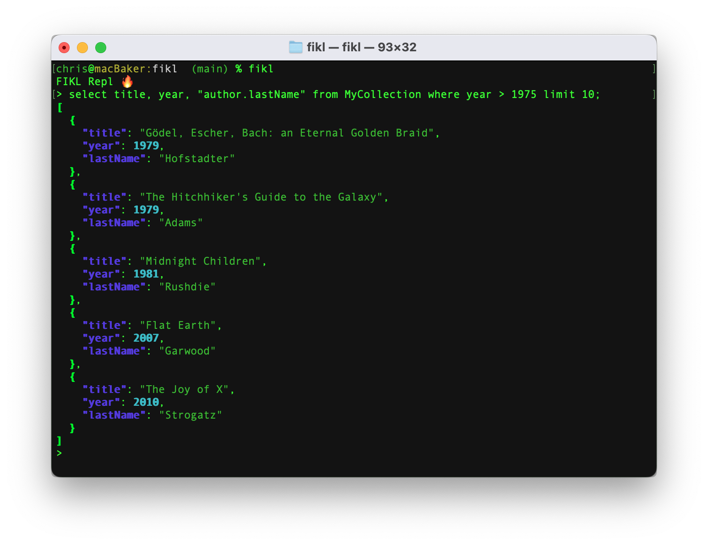

# Firestore Query Language

FIKL is a Firestore Query Languate CLI tool and REPL that allows users to execute SQL Like queries against a Firestore database.



* Supports `select`, `update`, `insert` & `delete` queries
* Supports server side and [local](#local-filtering-and-sorting) filtering and sorting
* Support for [`group by`](#group-by), [`count`](#count-documents) and [`distinct`](#distinct-queries)
* Support for [`like`](#like-queries) operator when using `local` queries
* Query results can be [output](#query-output) directly to a JSON file
* Full featured **REPL**


## How It Works
The FIKL CLI tool allows for SQL-like queries to be executed against a Firestore database.

1. Firestore essentially has 3 different query contexts:
   * **Document**
     *  Documents are fetched by specifying the path to that document. This is accomplised in FIKL by making use of the `at` keyword.
   * **Collection**
     *  Collections contain a number of documents and are queried by making use of the `from` keyword.
   * **Collection Group**
     *  Collection Groups are essentially a grouping of collections that are named the same but exist within different Documents. Make use of the `within` keyword to query within a Collection Groups.

## Build & Install
1. Create a new virtual environment so that you can have an isolated python environment
```sh
virtualenv venv
source venv/bin/activate
```
2. Install the required dependencies
```sh
pip install -r requirements.txt
```

3. Run lint and tests
```sh
pylint lang
python -m coverage run -m unittest && coverage report && coverage html
```

4. Use `pyinstaller` to create an executable. A `dist` directory will be created which will include the executable.
```sh
pyinstaller --clean -y -n fikl --add-data "fikl.lark:." ./lang/__main__.py
./dist/fikl/fikl
```

## Usage

Make sure that the `GOOGLE_APPLICATION_CREDENTIALS` environment variable is set and pointing to a Google Cloud credentials json file

1. To start a FIKL REPL.
```sh
fikl
```
_Note: Commands can run over multiple lines in the REPL and should be terminated with a semi-colon_

2. Supply a query as an argument to the fikl executable to execute a command direcly from the command prompt
```sh
fikl 'select * from MyCollection where year == 2005 limit 5'
```

3. Similary to SQL, a list of desired fields can be specified as part of a query. If all fields are required then `*` can be provided. Dot-notation can be used to fetch properties from a nested object (remember to surround with double-quotes)
```sh
fikl 'select title, "author.firstName" from MyCollection where year == 2005 limit 5'
```

## REPL Usage
* Simply run the `fikl` command to enter the REPL.
* Use the up arrow to recall previous statements
* Statements can run over multiple lines and should be terminated with a semi-colon
* Type exit to close the REPL

## Example Queries

### Document queries
To fetch a single document, note that there is no need to supply a `where` clause when fetching a single document
#### Fetch all fields of a single document
Make use of the `at` keyword and the path to the document:
```sql
select * at "some_collection/some_document_id"
```

#### Fetch specified fields of a single document
Instead of specifying __*__ in the field list, use a comma separated list of desired fields:
```sql
select title, "author.firstName" at "some_collection/some_document_id"
```

#### Update a document
Similar to SQL, use the set keyword followed by the fields to be updated and the respective values:
```sql
update at "some_collection/some_document_id" set title = "Some Title", "author.firstName" = "Bob"
```

#### Delete a document
```sql
delete at "some_collection/some_document_id"
```

### Collection queries
Collection queries and Collection Group queries share the same features. Collection queries make use of the `from` keyword while Collection Group queries use `within`.
#### Fetch all fields of a single document
Make use of the `from` keyword to indicate that a **collection** is being queried, or make use of `within` to indicate that a **collection group** is being queried:
```sql
select * from some_collection
```

#### Use a where clause to filter what is returned.
```sql
select * from some_collection where year == 2005 and "author.lastName" == "Diamond" limit 10
```

#### Use within to query a collection group.
```sql
select * within some_collection_group limit 10
```

#### Use an order by clause to sort what is returned.
```sql
select * from some_collection where year == 2005 and "author.lastName" == "Diamond" order by year desc, title limit 10
```

#### Local filtering and sorting
Complex where clauses often require an explicit Firestore Index to be created. You can make use of local filtering and sorting by making use of `^`. Place the `^` after the name of the field and that field will be evaluated locally. This avoids the need of having to create an explicit index when querying data in an ad-hoc manner. Combinations of server side and locally evaluated fields can be included in a single statement.
```sql
select * from some_collection where year == 2005 and "author.lastName"^ == "Diamond" order by year^ desc, title limit 10
```
In the above example, the `year` field will be included in the where clauses as part of the Firestore query, however the `author.lastName` field will be filtered locally. Likewise, sorting on the `year` field will be performed locally due to the ^ being used in the order by statement.

#### Like queries
When using a locally evaluated property `like` is a valid operator.
```sql
select * from some_collection where year == 2005 and "author.lastName"^ like "%iamond" order by year desc, title limit 10
```


#### Group by
The output of a query can be grouped by a single field
```sql
select * from some_collection where year == 2005 group by "author.lastName"
```

#### Distinct queries
The distinct keyword can be used to return a unique list of documents based on the desired fields
```sql
select distinct "author.lastName", year from some_collection where year == 2005
```

#### Count documents
The number of records that the query returns can be output as a single number
```sql
select count * from some_collection where year == 2005
```

#### Update documents in a collection (or collection group)
A `where` clause is mandatory when updating documents in a collection or collection group:
```sql
update from some_collection set title = "Some Title", "author.firstName" = "Bob" where year == 2005;
```

#### Delete documents in a collection (or collection group)
A `where` clause is mandatory when deleting documents in a collection or collection group:

```sql
delete from some_collection where year == 2005
```

#### Insert (add) a document into a collection
The identifier of the document that is being inserted is optional. If the "identified by" is not supplied, Firestore will automatically
set a document ID
```sql
insert into some_collection set year = 2005, title = "Mutants", "author.firstName" = "Armand", "author.lastName" = "Marie Leroi" identified by "some_document_id"
```
#### Query Output
The results of a query can be output directly to a file at the specified location
```sql
select year, "author.firstName", "author.lastName" output "~/Desktop/books.json"
```
Or directly to the clipboard
```sql
select year, "author.firstName", "author.lastName" copy
```