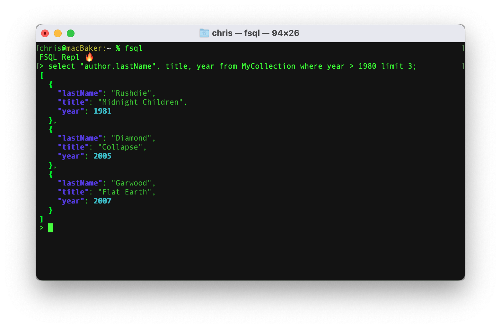

# Firestore Query Language

FSQL is a Firestore Query Languate CLI tool that allows users to execute SQL Like queries against a Firestore database.

* Supports **SELECT**, **UPDATE** & **DELETE** queries
* Full featured **REPL**

<p align="center">
  
</p>

## How It Works
The FSQL CLI tool allows for SQL-like queries to be executed against a Firestore database.

1. Firestore essentially has 3 different query contexts:
   * **Document**
     *  Documents are fetched by specifying the path to that document. This is accomplised in FSQL by making use of the `at` keyword.
   * **Collection**
     *  Collections contain a number of documents and are queried by making use of the `from` keyword.
   * **Collection Group**
     *  Collection Groups are essentially a grouping of collections that are named the same but exist within different Documents. Make use of the `within` keyword to query within a Collection Groups.
1. Using Lark, the input text is parsed and the Python Firebase SDK is used to execute queries against the Firestore database.

## Build & Install
1. Create a new virtual environment so that you can have an isolated python environment
```sh
virtualenv venv
source env_name/bin/activate
```
2. Install the required dependencies
```sh
pip install -r requirements.txt
```

3. Run lint and tests
```sh
pylint lang
python -m coverage run -m unittest
```

4. Use `pyinstaller` to create an executable. A `dist` directory will be created which will include the executable.
```sh
pyinstaller --clean -n fsql --add-data "fsql.lark:." ./lang/__main__.py
./dist/fsql/fsql
```

## Usage

Make sure that the `GOOGLE_APPLICATION_CREDENTIALS` environment variable is set and pointing to a Google Cloud credentials json file

1. To start a FSQL REPL.
```sh
fsql
```
_Note: Commands can run over multiple lines in the REPL and should be terminated with a semi-colon_

2. Supply a query as an argument to the fsql executable to execute a command direcly from the command prompt
```sh
fsql 'select * from MyCollection where year == 2005 limit 5'
```

3. Similary to SQL, a list of desired fields can be specified as part of a query. If all fields are required then `*` can be provided. Dot-notation can be used to fetch properties from a nested object (remember to surround with double-quotes)
```sh
fsql 'select title, "author.firstName" from MyCollection where year == 2005 limit 5'
```

## Example Queries
### Document queries
To fetch a single document, note that there is no need to a where clause when fetching a single document
#### Fetch all fields of a single document
Make use of the `at` keyword and the path to the document:
```sql
select * at "SOME_COLLECTION/DOC_ID"
```

#### Fetch specified fields of a single document
Instead of specifying * in the field list, use a comma separated list of desired fields:
```sql
select title, "author.firstName" at "SOME_COLLECTION/DOC_ID"
```

#### Update a document
Similary to SQL, use the set keyword followed by the fields to be updated and the value to set those respective fields to:
```sql
update at "SOME_COLLECTION/DOC_ID" set title = "Some Title", "author.firstName" = "Bob"
```

#### Delete a document
```sql
delete at "SOME_COLLECTION/DOC_ID"
```

### Collection queries
To fetch documents from a collection
#### Fetch all fields of a single document
Make use of the `from` keyword to indicate that a **collection** is being queried, or make use of `within` to indicate that a **collection group** is being queried:
```sql
select * from SOME_COLLECTION
```

#### Use a where clause to filter what is returned.
_Remember that Firestore requires explicit indexes when filtering by more than one property_:
```sql
select * from SOME_COLLECTION where year == 2005 and "author.lastName" == "Diamond" limit 10
```

#### Update documents in a collection
A `where` clause is mandatory when updating documents in a collection or collection group:
```sql
update from SOME_COLLECTION set title = "Some Title", "author.firstName" = "Bob" where year == 2005;
```

#### Delete documents in a collection (or collection group)
A `where` clause is mandatory when deleting documents in a collection or collection group:

```sql
delete from SOME_COLLECTION where year == 2005
```

## Powerfull when used with `jq`
https://jqlang.github.io/jq/